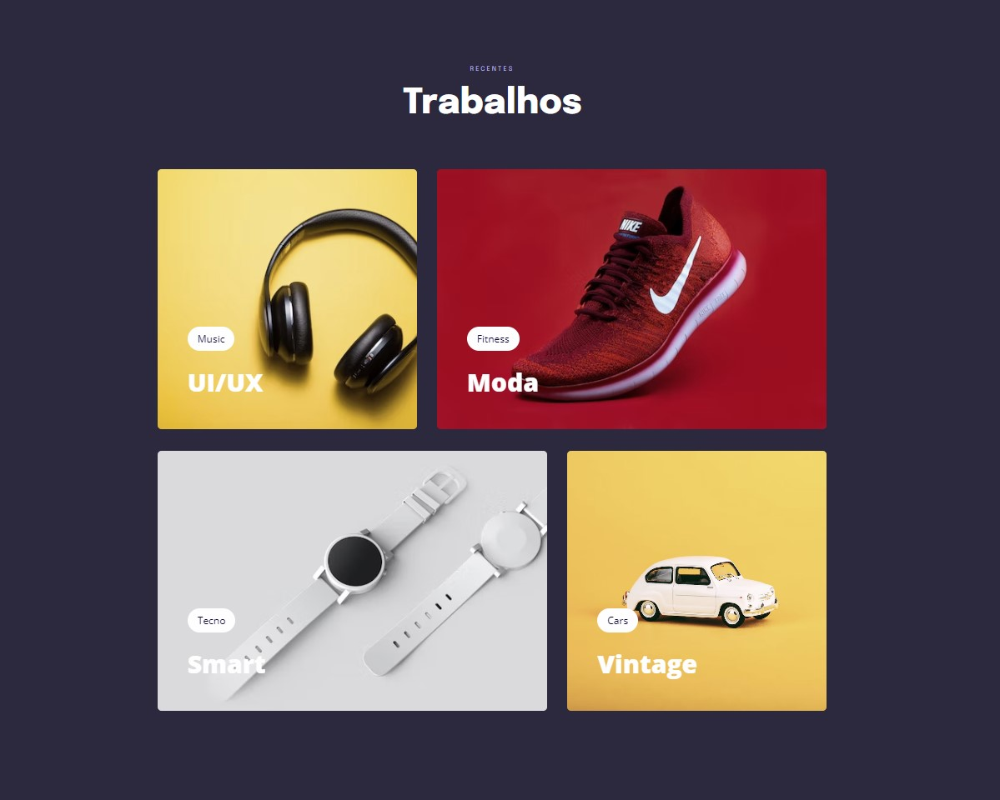

## 💻 Projeto

Este projeto foi desenvolvido no treinamento do Explorer da Rocketseat. O conteúdo deste projeto foi sensacional, muito conteúdo avançado do CSS, foi abordado as seguintes configurações:
 
<ul>
  <li>Variáveis</li>
  <li>Responsivdade com @media</li>
  <li>Transições</li>
  <li>Transformações</li>
  <li>Animações</li>
  <li>Filtros em imagens</li>
  <li>Utilização do Clamp</li>
</ul>
 

  

 

## 🎯 Deploy
Veja o site publicado [clicando aqui](https://allanfrancis.github.io/Explorer-Projeto-06/).
 
 

## 🚀 Tecnologias
Esse projeto foi desenvolvido com as seguintes tecnologias:
- HTML e CSS
- VS Code
- Git e Github
- Figma
 
 

## 🔖 Layout

Para visualizar o projeto no figma, basta [clicar aqui](https://www.figma.com/file/4EwWwXBiDXQewLWSiAMHBB/Explorer-Stage-03-Projeto-03-(Copy)?node-id=203%3A1865&t=LumLFbncWWRnkX9r-0). É necessário ter conta no [Figma](https://figma.com) para acessá-lo.